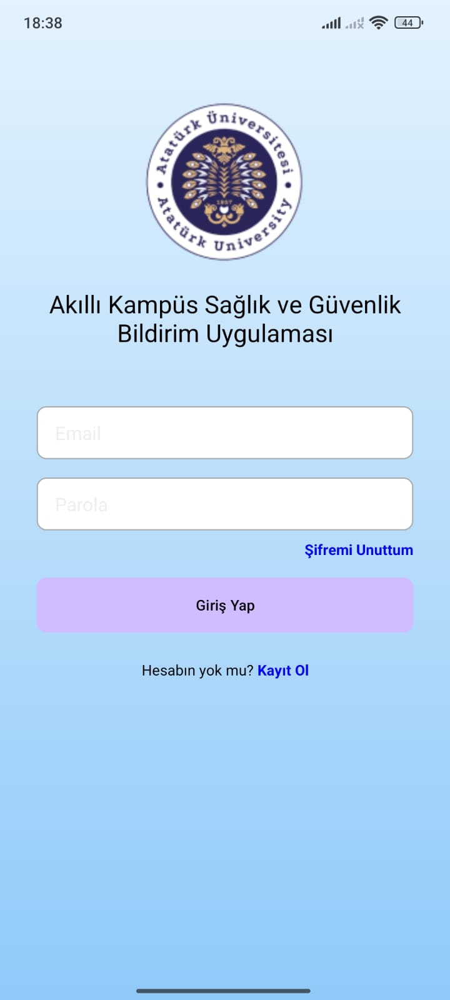
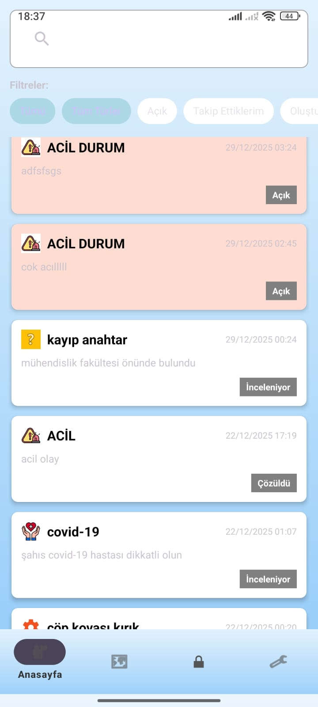
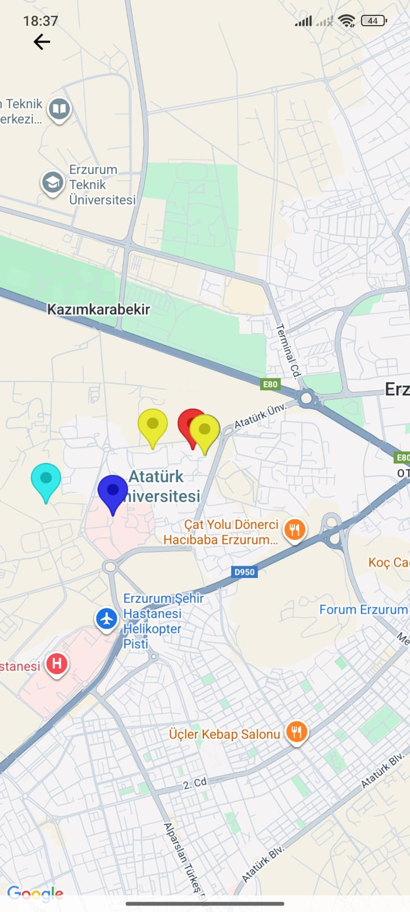
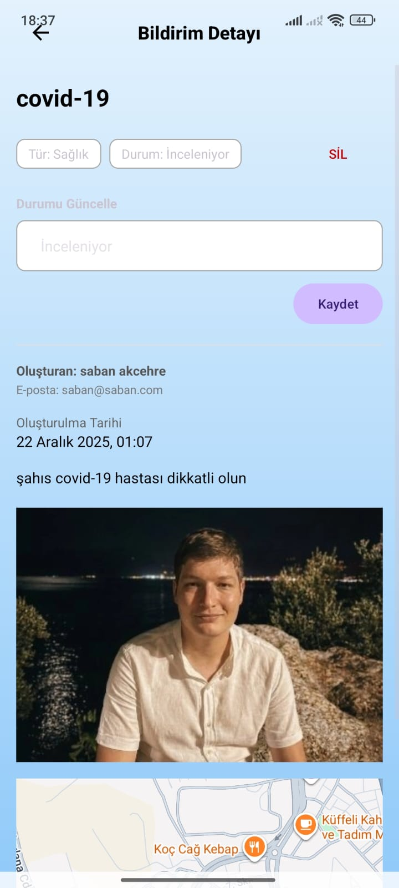
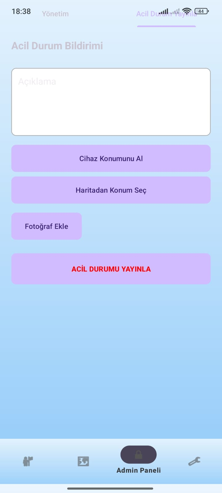
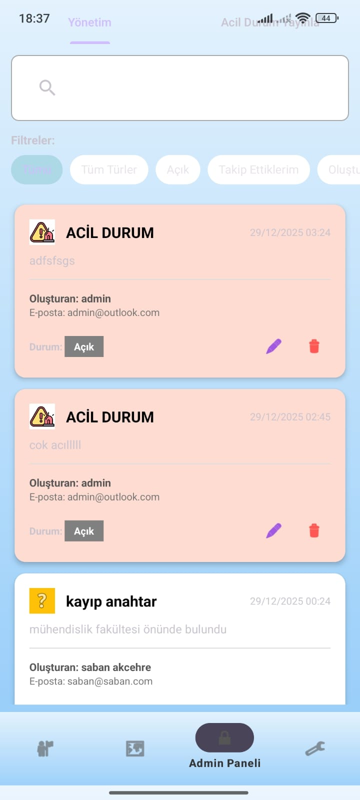
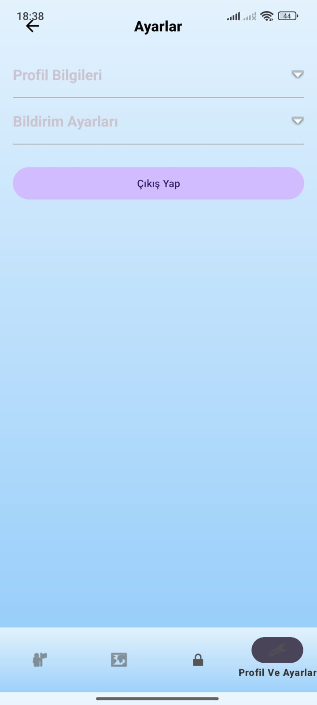

# 🛡️ Kampüs İçi Bildirim ve Güvenlik Sistemi

Kotlin ve Firebase kullanılarak geliştirilmiş, üniversite kampüsleri için **konum tabanlı sorun ve acil durum bildirimlerini** hızlı ve güvenli şekilde yönetmeyi amaçlayan modern bir Android uygulamasıdır.

Bu uygulama sayesinde öğrenciler kampüs içinde karşılaştıkları problemleri kolayca raporlayabilir, yöneticiler ise bu bildirimleri gerçek zamanlı olarak takip edip yönetebilir.

---

## 🚀 Özellikler

### 👤 Kullanıcı Özellikleri

* **Giriş / Kayıt**
  Firebase Authentication ile güvenli kullanıcı doğrulama.

* **Konum Tabanlı Bildirim**
  Teknik, temizlik, güvenlik vb. sorunları harita üzerinden konum seçerek veya cihazın mevcut konumunu kullanarak raporlama.

* **Fotoğraf Kanıtı**
  Bildirimlere Firebase Storage üzerinden fotoğraf ekleyebilme.

* **Gerçek Zamanlı Takip**
  Bildirim durumlarını anlık olarak izleme:

  * Açık
  * İnceleniyor
  * Çözüldü

* **Akıllı Filtreleme**
  Arama çubuğu ve kategori bazlı filtreler (Chip) ile bildirimlere hızlı erişim.

* **Kişiselleştirilmiş Bildirimler**
  Sadece ilgi duyulan kategorilerdeki bildirimleri ana ekranda görme seçeneği.

---

### 🔑 Admin Özellikleri (Rol Tabanlı Yetkilendirme)

* **Durum Yönetimi**
  Bildirimlerin çözüm sürecini anlık olarak güncelleme.

* **Acil Durum Yayınlama**
  Tüm kullanıcılara anında iletilen ve ana ekranda sabitlenen kırmızı öncelikli acil durum bildirimleri oluşturma.

* **İçerik Denetimi**
  Gereksiz veya asılsız bildirimleri sistemden tamamen silme.

* **Kullanıcı Takibi**
  Bildirimi oluşturan kullanıcıların detaylarını görüntüleme yetkisi.

---

## 🛠️ Kullanılan Teknolojiler

* **Dil:** Kotlin
* **Veritabanı:** Firebase Firestore (NoSQL, Real-time)
* **Kimlik Doğrulama:** Firebase Authentication
* **Dosya Saklama:** Firebase Storage (fotoğraflar için)
* **Harita Servisleri:** Google Maps SDK & Google Play Services Location
* **Görsel Yükleme:** Glide
* **UI Bileşenleri:**

  * Material Design Components
  * RecyclerView
  * ViewBinding
  * ConstraintLayout
  * Lottie (opsiyonel)

---

## 📸 Ekran Görüntüleri

Aşağıda uygulamaya ait temel ekran görüntülerini görebilirsiniz:

### 🔐 Giriş / Kayıt Ekranı



### 🗺️ Ana Ekran (Harita + Liste)



### 📍 Harita Görünümü



### ➕ Yeni Bildirim Oluşturma



### 🚨 Acil Durum Bildirimi



### 🛠️ Admin Paneli



### ⚙️ Ayarlar



---:|:---:|:---:|
| Ana Ekran | Ekleme | Detay |

---

## 🏗️ Proje Yapısı

```text
app/src/main/java/com/example/mobilprogramlamaproje/
├── AnasayfaActivity.kt              # Ana ekran, filtreleme ve harita işlemleri
├── BildirimEkleActivity.kt          # Yeni bildirim oluşturma, konum ve fotoğraf seçimi
├── NotificationDetailActivity.kt    # Bildirim detayları ve admin yönetimi
├── NotificationsAdapter.kt          # Liste yönetimi ve dinamik renklendirme
└── Register/LoginActivities.kt      # Kullanıcı kimlik doğrulama işlemleri
```

---

## ⚙️ Kurulum

1. Bu projeyi bilgisayarınıza **clone** veya **download** edin.
2. Android Studio ile projeyi açın.
3. Firebase Console üzerinden yeni bir proje oluşturun.
4. `google-services.json` dosyasını indirip **app/** dizinine ekleyin.
5. Google Cloud Console üzerinden **Maps SDK** API anahtarınızı alın ve `AndroidManifest.xml` dosyasına ekleyin.
6. Projeyi derleyin ve çalıştırın.

---

## 🎯 Amaç

Bu proje, üniversite kampüslerinde güvenliği artırmayı, sorunların hızlı şekilde raporlanmasını ve yönetilmesini sağlamayı hedefler.

---

> 📌 Katkıda bulunmak, öneri sunmak veya geliştirme yapmak için **Pull Request** gönderebilirsiniz.
